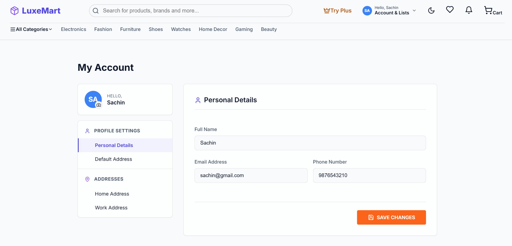
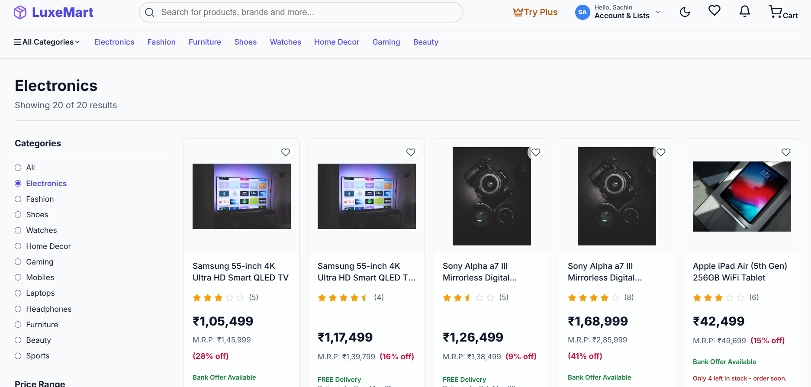
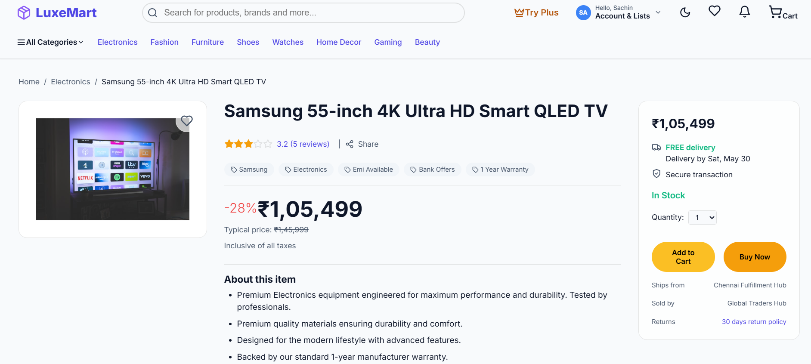
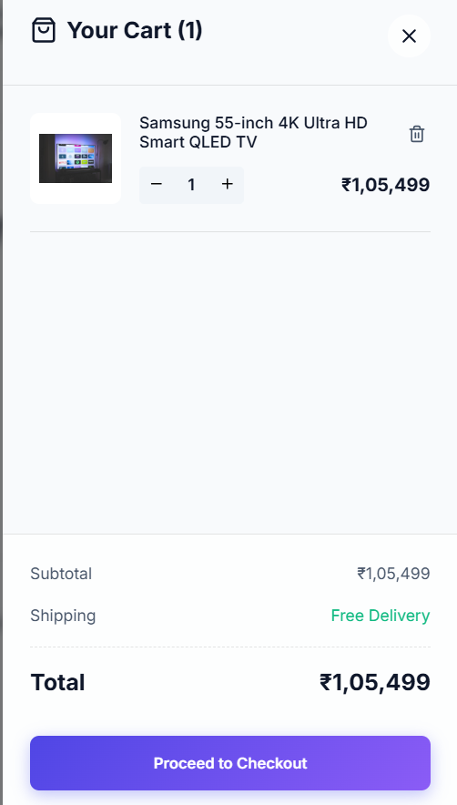
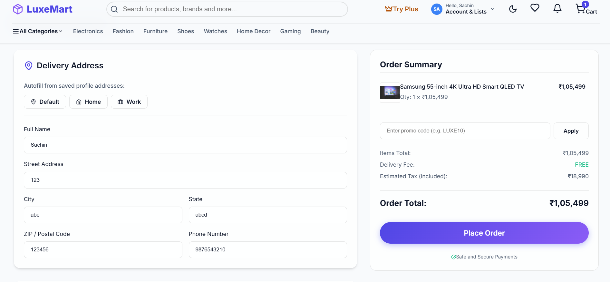
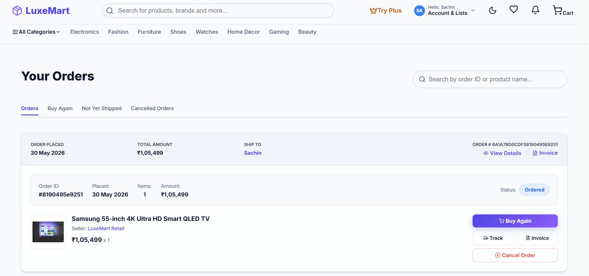

# 🛍️ LuxeMart — Full-Stack E-Commerce Platform

> A premium, production-grade MERN e-commerce application with glassmorphism UI, membership tiers, real-time cart management, PDF invoices, order tracking, and a full admin panel.

---

## 📋 Table of Contents

- [Project Overview](#-project-overview)
- [Features](#-features)
- [Tech Stack](#-tech-stack)
- [Project Structure](#-project-structure)
- [Installation](#-installation-local-development)
- [Environment Variables](#️-environment-variables)
- [Running the App](#-running-the-app)
- [Screenshots](#-screenshots)
- [Future Enhancements](#-future-enhancements)
- [Author](#-author)

---

## 🏪 Project Overview

LuxeMart is a feature-complete, full-stack e-commerce platform built as a portfolio project. It supports user authentication, product browsing with filters, cart and wishlist management, tiered membership plans, Razorpay payment integration (test mode), order tracking, review and rating systems, PDF invoice generation, and an admin panel for product and order management.

---

## ✨ Features

### 🛒 Shopping Experience
- Product catalogue with category filters, search, sort, and pagination
- Product detail page with image display, ratings, stock status, and delivery estimates
- Cart with quantity management and real-time total calculation
- Wishlist with persistent localStorage storage

### 🔐 Authentication
- JWT-based registration & login
- Protected routes for orders, checkout, profile, and wishlist
- Persistent auth state via localStorage

### 💳 Checkout & Payments
- Multi-step checkout (Delivery → Payment → Confirm)
- Razorpay payment gateway (test mode)
- Cash on Delivery option
- Out-of-stock prevention at cart and checkout level
- Membership discount applied automatically

### 👑 Membership System
- Four tiers: Basic, Plus, Prime, Elite
- Tier-based discounts and free premium delivery
- Simulated payment flow for membership upgrades
- Persistent membership state

### 📦 Orders & Tracking
- Full order history with status timeline
- Package tracking with shipment hub updates
- Order cancellation with reason and inventory restoration
- "Buy Again" functionality
- Seller feedback modal

### 🧾 Invoice
- Printable invoice with GST breakdown
- PDF download via jsPDF + html2canvas
- Full order and address details

### ⭐ Review System
- Submit, edit, and delete product reviews
- Average rating recalculation
- Positive/Negative review split display
- Verified Purchase badge

### 📊 Admin Panel
- Admin Dashboard with order and product stats
- Product CRUD with Cloudinary image upload
- Order management with status updates

### 🎨 UI/UX
- Glassmorphism design with dark/light mode toggle
- Skeleton loaders and smooth Framer Motion animations
- Fully responsive (mobile-first)
- Accessible UI with ARIA labels

---

## 🛠️ Tech Stack

| Layer       | Technology                                      |
|-------------|-------------------------------------------------|
| Frontend    | React 18, Vite, React Router v6, Framer Motion  |
| Styling     | Vanilla CSS(custom design system, glassmorphism)|
| State       | React Context API (Cart, Auth, Wishlist, Theme) |
| Backend     | Node.js, Express.js                             |
| Database    | MongoDB Atlas + Mongoose ODM                    |
| Auth        | JWT (jsonwebtoken) + bcryptjs                   |
| Payments    | Razorpay (test mode)                            |
| File Upload | Cloudinary + Multer                             |
| PDF         | jsPDF + html2canvas                             |
| Security    | Helmet, express-rate-limit, CORS whitelist      |

---

## 📁 Project Structure

```
E commerce/
├── client/                   # React + Vite Frontend
│   ├── src/
│   │   ├── components/       # Reusable UI components
│   │   │   ├── Navbar.jsx
│   │   │   ├── HeroCarousel.jsx
│   │   │   ├── ProductCard.jsx
│   │   │   ├── CartDrawer.jsx
│   │   │   ├── DeferredSections.jsx
│   │   │   ├── SkeletonLoader.jsx
│   │   │   ├── ImageWithFallback.jsx
│   │   │   ├── EmptyState.jsx
│   │   │   ├── Footer.jsx
│   │   │   └── Loader.jsx
│   │   ├── pages/            # Route-level page components
│   │   │   ├── Home.jsx
│   │   │   ├── Products.jsx
│   │   │   ├── ProductDetails.jsx
│   │   │   ├── Cart.jsx
│   │   │   ├── Checkout.jsx
│   │   │   ├── Orders.jsx
│   │   │   ├── Invoice.jsx
│   │   │   ├── Profile.jsx
│   │   │   ├── Wishlist.jsx
│   │   │   ├── Membership.jsx
│   │   │   ├── SignIn.jsx
│   │   │   ├── SignUp.jsx
│   │   │   └── admin/
│   │   │       ├── AdminDashboard.jsx
│   │   │       ├── AdminProducts.jsx
│   │   │       └── AdminOrders.jsx
│   │   ├── context/          # React Context providers
│   │   │   ├── AuthContext.jsx
│   │   │   ├── CartContext.jsx
│   │   │   ├── WishlistContext.jsx
│   │   │   └── ThemeContext.jsx
│   │   ├── services/
│   │   │   └── api.js        # Axios instance with interceptors
│   │   ├── App.jsx
│   │   └── main.jsx
│   ├── index.html
│   ├── vite.config.js
│   └── .env.example
│
└── server/                   # Node.js + Express Backend
    ├── config/
    │   ├── db.js             # MongoDB connection
    │   └── cloudinary.js     # Cloudinary + Multer setup
    ├── controllers/          # Route logic
    ├── middleware/           # Auth, error handlers
    ├── models/               # Mongoose schemas
    ├── routes/               # Express routers
    ├── seed.js               # Database seeder script
    ├── server.js             # App entry point
    └── .env.example
```

---

## ⚙️ Installation (Local Development)

### Prerequisites
- Node.js v18+
- npm v9+
- MongoDB Atlas account (free tier works)
- Razorpay test account (optional for payment testing)
- Cloudinary account (optional for image uploads)

### 1. Clone the repository
```bash
git clone https://github.com/YOUR_USERNAME/luxemart.git
cd luxemart
```

### 2. Backend Setup
```bash
cd server
npm install
```

Copy the example env file and fill in your values:
```bash
cp .env.example .env
```

### 3. Frontend Setup
```bash
cd ../client
npm install
cp .env.example .env
```

### 4. Seed the database (optional)
```bash
cd server
npm run seed
```

---

## 🔑 Environment Variables

### `server/.env`
```env
PORT=5000
MONGODB_URI=your_mongodb_connection_string
CLIENT_URL=http://localhost:5173
NODE_ENV=development
JWT_SECRET=your_jwt_secret_key
RAZORPAY_KEY_ID=rzp_test_your_key_id
RAZORPAY_KEY_SECRET=your_razorpay_secret
CLOUDINARY_CLOUD_NAME=your_cloud_name
CLOUDINARY_API_KEY=your_api_key
CLOUDINARY_API_SECRET=your_api_secret
```

### `client/.env`
```env
VITE_API_URL=http://localhost:5000/api
```

> ⚠️ **Never commit `.env` files.** They are listed in `.gitignore`.

---

## 🚀 Running the App

### Start the Backend
```bash
cd server
npm run dev
```
Server starts at `http://localhost:5000`

### Start the Frontend
```bash
cd client
npm run dev
```
App opens at `http://localhost:5173`

### Production Build (Frontend)
```bash
cd client
npm run build
npm run preview
```

---


## 📸 Screenshots

### Home Page



### Products Page



### Product Details



### Shopping Cart



### Checkout



### Orders




---

## 🔮 Future Enhancements

- [ ] Real-time order status via WebSockets
- [ ] Product image gallery (multiple images per product)
- [ ] Coupon / promo code system
- [ ] Email notifications for order updates
- [ ] AI-powered product recommendations
- [ ] Full Razorpay live-mode integration
- [ ] Progressive Web App (PWA) support
- [ ] Unit and integration test suite (Vitest + Supertest)

---

## 👨‍💻 Author

**Sachin J**  
Full-Stack Developer | MERN Stack  

- 🐙 GitHub: [github.com/sachin-220](https://github.com/sachin-220)
- 💼 LinkedIn: [linkedin.com/in/sachin-j-50583432b](https://www.linkedin.com/in/sachin-j-50583432b/)

---
